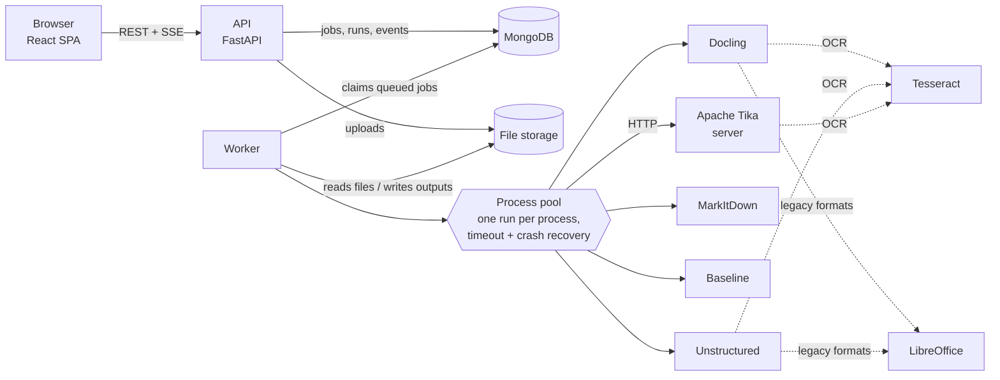
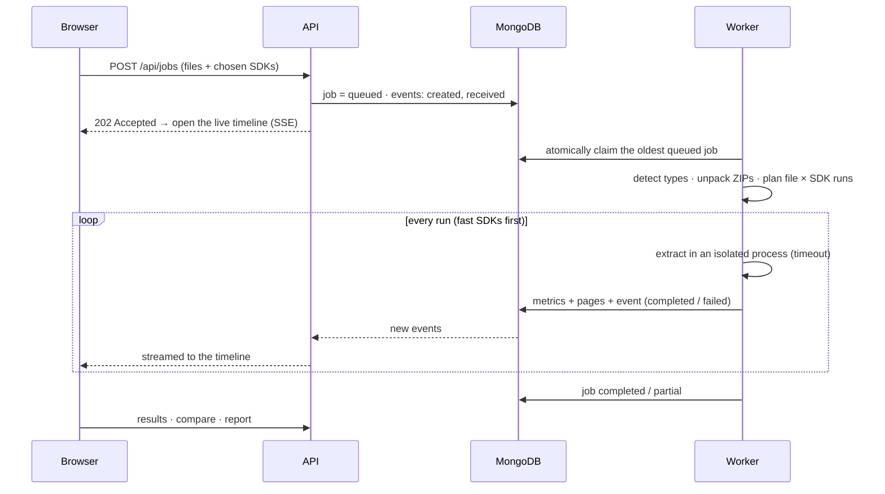

<div align="center">

# X-tractor

### Benchmark document-extraction SDKs on your own files — live, side by side, page by page.

Upload PDFs, Office files, emails, scans or a whole ZIP package. X-tractor runs **Docling, Unstructured, Apache Tika, MarkItDown** and a **baseline** on every file, streams each step to a live timeline, and tells you which extractor produces the best AI-ready text — with the evidence to back it up.


</div>

---

## The problem

Every AI pipeline that reads documents — RAG, contract review, invoice processing, search — starts with the same step: **turn files into clean text**. That step quietly decides the quality of everything after it.

- A PDF loses its **page numbers**, and the AI can no longer cite its sources.
- A table becomes a soup of words, and quantities and prices are misread.
- A scanned page comes back **empty**, and the system never knows the information existed.
- Special characters break (`ö` → `ö`), and search and matching silently fail.

There are many extraction libraries, each with different strengths, and their own benchmarks rarely look like *your* documents. Teams usually pick one from a blog post and find its weak spots in production.

## What X-tractor does

X-tractor turns *"which extractor should we use?"* from a guess into a **measured decision**:

1. **Upload** real documents — any mix of formats, or one ZIP with nested folders and ZIPs.
2. **Choose** the extractors and options (OCR on/off, OCR languages, table detection).
3. **Watch** every extractor process every file, live: file-type detection, archive unpacking, OCR, conversions, warnings and failures, all on one timeline.
4. **Inspect** the output of each extractor page by page, in every format it produces (Markdown, JSON, HTML, text, DocTags, XHTML…).
5. **Compare** two extractors on the same page, side by side, with a text-overlap score.
6. **Decide** with a report: a quality score per file, a winner per file, and a leaderboard across the whole set.

The result is a clear, explainable answer for your documents — plus normalised, page-accurate text ready to feed an AI pipeline.

## Who it is for

- **AI / RAG engineers** choosing an ingestion library before building a pipeline.
- **Teams processing business documents** (contracts, tenders, invoices, reports, email archives) who need page-level citations.
- **Anyone migrating extractors**, who wants proof that the new one is better on their own files before switching.

## The extractors

| Extractor | Approach | Strength | Output modes |
|---|---|---|---|
| **Docling** (IBM) | AI layout + table-structure models, OCR only where pages lack text | Tables, reading order, page provenance | Markdown · JSON · HTML · Text · DocTags |
| **Unstructured** | Typed elements with page metadata (`fast` / `hi_res`) | Very wide format coverage, element-level chunks | JSON · Text · HTML · Markdown |
| **Apache Tika** | Java parsers behind a REST server | 1000+ formats incl. legacy Office, fast | Text · XHTML · Metadata JSON |
| **MarkItDown** (Microsoft) | Fast conversion to one Markdown string | Speed, clean Markdown for simple files | Markdown |
| **Baseline** | pypdf · python-docx · openpyxl · xlrd · extract-msg | The reference point every SDK must beat | Text · JSON |

All run **locally** — no API keys, no per-page fees, no documents sent to third parties. Docling and Unstructured use small open AI models that run on the CPU; OCR uses Tesseract.

## Features

**Extraction**
- One normalised output per run: `pages: [{n, text, tables, images}]` — page numbers survive for citations
- Every native format each SDK produces, viewable rendered or as source, with copy and download
- Content-based file-type detection (magic bytes), so a mislabelled file is still read correctly
- Safe ZIP unpacking (nested archives; limits on entries, size, compression ratio and depth)
- Legacy formats (`.doc`, `.xls`, `.ppt`, `.rtf`) converted with headless LibreOffice
- OCR with configurable languages, applied only where a page has no text layer

**Measurement**
- Per-run metrics: pages, % of pages with text, words, tables, images, special-character count, broken-character detection, speed, whether page boundaries were kept
- A transparent relative quality score per file (weights shown in the UI), a winner per file and an SDK leaderboard
- Measured statistics per SDK across all runs: success rate, speed, coverage, results by file type

**Experience**
- Six-step flow with a page per step: Upload → Configure → Extract → Results → Compare → Report
- Live event timeline over Server-Sent Events, resumable after a dropped connection
- SDK catalogue with capability profiles, a format-support matrix and live availability
- Clean light UI with dark mode, responsive down to mobile, skeleton loaders and motion

**Reliability**
- Partial failure is normal: a corrupt file or a crashing SDK never stops the job
- Each run executes in an isolated process with a timeout; a hung or crashed SDK is killed and the pool rebuilt
- Failed runs can be retried; stale jobs from a dead worker are requeued automatically

## How it works





**Design decisions**

- **API and worker are separate processes.** Extraction is CPU-heavy; the API must stay responsive. Workers claim jobs atomically (`find_one_and_update`), send heartbeats, and can be scaled horizontally.
- **Events are an append-only log** with a per-job sequence number. The SSE stream resumes from `Last-Event-ID` and works with any number of API instances — no message broker needed.
- **The worker reports its own capabilities** (SDK versions, OCR languages, LibreOffice, Tika) in its heartbeat. The API shows that view, so a slim API container still displays what the extraction machine can actually do.
- **Fast SDKs run first**, so results appear within seconds while slower AI models are still working.

## Tech stack

| Layer | Technology |
|---|---|
| Frontend | React 19 · Vite 8 · JavaScript · Tailwind CSS v4 · TanStack Query · React Router · Motion · Recharts |
| API | Python 3.12 · FastAPI · Pydantic v2 · PyMongo (async) · Server-Sent Events · JWT in httpOnly cookies |
| Worker | asyncio · multiprocessing pool · Docling · Unstructured · MarkItDown · pypdf · python-docx · openpyxl |
| Services | MongoDB · Apache Tika server · Tesseract OCR · LibreOffice (headless) |
| Delivery | Multi-stage Docker images (non-root, health checks) · Docker Compose · nginx |
| Quality | pytest (unit + API tests) · Ruff · oxlint |

## Security & production readiness

- Streaming uploads with per-file and per-job limits; content-based type detection
- ZIP-bomb protection (entries, total size, ratio, depth) and path-traversal-safe unpacking
- Session JWT in an httpOnly, SameSite cookie; constant-time credential check; login rate limiting
- Untrusted HTML output rendered in a sandboxed iframe; strict Content-Security-Policy from nginx
- Production settings validated at start-up (refuses default secrets, insecure cookies, wildcard CORS)
- Structured JSON logs; database connection retries; health endpoints for the API, worker and web
- Docker images run as non-root, contain no compilers or caches, and bake the AI models in so the worker runs **fully offline**

## Run it

### With Docker (recommended)

```bash
git clone https://github.com/premkumar-ponnada/X-tractor.git
cd X-tractor
cp .env.docker.example .env        # set XT_AUTH_PASSWORD and XT_JWT_SECRET
docker compose build
docker compose up -d               # → http://localhost:8080
```

Five containers start: MongoDB, Apache Tika, the API, the worker and the web UI.

| Image | Contents |
|---|---|
| `xtractor-api` | FastAPI only — small and fast to start |
| `xtractor-worker` | All SDKs, CPU-only PyTorch, Tesseract (multi-language), LibreOffice, pre-downloaded AI models |
| `xtractor-web` | Static React build on unprivileged nginx with an SSE-safe `/api` proxy |

### Local development

Requires Python 3.12, Node 20+, MongoDB, Java 11+ and Tesseract (LibreOffice optional, for legacy formats).

```bash
# backend
cd backend
python -m venv venv && venv/Scripts/activate        # macOS/Linux: source venv/bin/activate
pip install -r requirements-dev.txt
cp .env.example .env                                # set the login and JWT secret
python scripts/prepare_models.py                    # one-time model download
python run_backend.py                               # API + worker + Tika in one terminal

# frontend (second terminal)
cd frontend
npm install
npm run dev                                         # → http://localhost:5173
```

The Tika server jar goes in `tools/tika/` ([download](https://archive.apache.org/dist/tika/3.3.2/tika-server-standard-3.3.2.jar)). On Windows, run `pip uninstall -y python-magic` after installing (it hangs without libmagic; X-tractor detects file types itself).

### Try every format

```bash
python backend/scripts/make_format_pack.py
```

This generates 23 synthetic files — text and scanned PDF, DOCX/DOC/RTF/ODT, XLSX/XLS/ODS/CSV, PPTX/PPT/ODP, HTML, Markdown, TXT, XML, EML with an attachment, EPUB, PNG/JPG/TIFF scans and a nested ZIP — in `test-files/format-pack/`. Upload them all and select every extractor.

## API

Interactive docs at `/api/docs` (disabled in production). All routes except `health` and `auth/login` require a session.

| Method | Path | Purpose |
|---|---|---|
| `POST` | `/api/auth/login` · `/api/auth/logout` · `GET /api/auth/me` | Session |
| `GET` | `/api/sdks` · `/api/sdks/{name}` | Profiles, capabilities, formats, live availability |
| `POST` | `/api/jobs` | Upload files + choose SDKs → `202 Accepted` |
| `GET` | `/api/jobs` · `/api/jobs/{id}` | History and job detail |
| `GET` | `/api/jobs/{id}/events` | Live event stream (SSE) |
| `POST` / `DELETE` | `/api/jobs/{id}/cancel` · `/retry` · `/api/jobs/{id}` | Job control |
| `GET` | `/api/runs/{id}/pages` · `/output?format=` · `/download?format=` | Extracted pages and native outputs |
| `GET` | `/api/jobs/{id}/compare?file_id=` · `/api/jobs/{id}/report` | Comparison and scoring |
| `GET` | `/api/stats/overview` · `/api/stats/sdks` · `/api/health` | Dashboard, measured stats, health |

## Project structure

```
X-tractor/
├── backend/
│   ├── config/          settings (XT_* environment variables, validated)
│   ├── core/            database, security, storage, errors, JSON logging
│   ├── extractors/      one adapter per SDK + detection, ZIP safety, metrics, profiles, capabilities
│   ├── features/        auth · sdks · jobs · results · stats  (routes / service / repository)
│   ├── worker/          job runner, isolated process pool, child entrypoint
│   ├── scripts/         model download, format test pack
│   ├── tests/           pytest suite + synthetic fixtures
│   ├── run_backend.py   local launcher: API + worker + Tika
│   └── Dockerfile       multi-stage → api / worker images
├── frontend/
│   ├── src/             pages · layouts · components · hooks · context · lib
│   ├── nginx/           production nginx template (CSP, SSE proxy)
│   └── Dockerfile       multi-stage → web image
└── docker-compose.yml
```

## Quality checks

```bash
cd backend  && pytest && ruff check . && ruff format --check .
cd frontend && npx oxlint && npm run build
```

30 backend tests cover file detection, ZIP safety limits, metrics, scoring, each fast extractor, legacy-format conversion and the API (auth, validation, job lifecycle) against an isolated test database.

## Roadmap

- User accounts and roles (replacing the single configured login)
- Cloud deployment templates (container apps, managed MongoDB, blob storage)
- More extractors (e.g. cloud document-intelligence services) as optional plug-ins
- Ground-truth mode: score extractors against a hand-checked reference text
- GPU worker profile for faster AI-model extraction

---

<div align="center">

Built by **[Prem Kumar Ponnada](https://github.com/premkumar-ponnada)**

</div>
